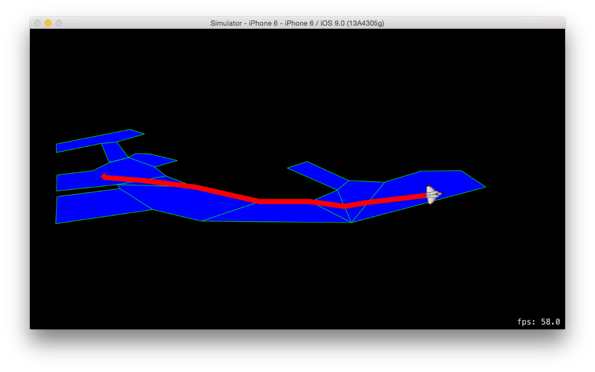
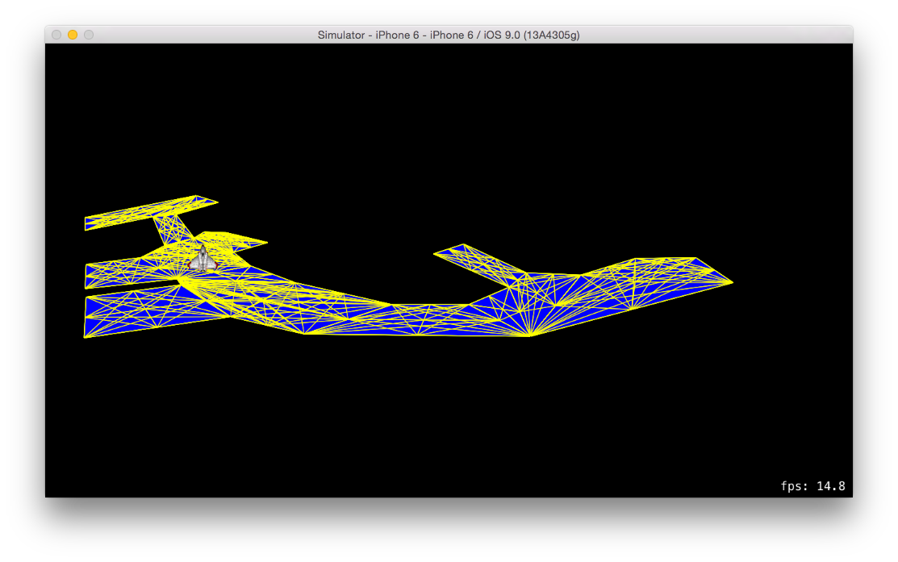

# NavigationMeshGraph




A `NavigationMeshGraph` is a kind of `GKGraph` that will do pathfinding based on a navigation mesh defined by **convex** polygons. Unlike the `GKObstacleGraph`, this graph navigates such that the path stays on the mesh defined by the given polygons.

## Features

- Uses `GameplayKit` for pathfinding to keep the user within a mesh of convex polygons
- Allows you to connect a node to it and find the closest point on the navigation mesh to connect it

## Requirements

- iOS 9.0+ / Mac OS X 10.11+
- Xcode 7

## Installation Using CocoaPods

[CocoaPods](http://cocoapods.org) is a dependency manager for Cocoa projects.

Because `NavigationMeshGraph` is written in Swift, you must use frameworks.

To integrate `NavigationMeshGraph` into your Xcode project using CocoaPods, specify it in your `Podfile`:

```ruby
source 'https://github.com/CocoaPods/Specs.git'
platform :ios, '9.0'
use_frameworks!

pod 'NavigationMeshGraph'
```

Then, run the following command:

```bash
$ pod install
```

## Usage

Create an array of `NavigationMeshPolygon` objects and initialize a `NavigationMeshGraph` with them:

```swift
let graph = NavigationMeshGraph(polygons: polygons)
```

This will then go through the polygons and create a graph of `GKGraphNode2D` using the vertices of the polygons, their centroids, and the midpoints of their edges. You can then connect two nodes in order to find the path between them like so:

```swift
let startNode = GKGraphNode2D(point: float2(startPosition))
let endNode = GKGraphNode2D(point: float2(endPosition))

graph.connectNodeToClosestPointOnNavigationMesh(startNode)
graph.connectNodeToClosestPointOnNavigationMesh(endNode)
```

Note the usage of the `connectNodeToClosestPointOnNavigationMesh` method, which connects the node based on the navigation mesh. If you specify a node that is not in the mesh, it will calculate the nearest point to the mesh and move the node there before connecting it to its neighbors. Once the nodes are connected, you can then find the path as expected:

```swift
let path = graph.findPathFromNode(startNode, toNode: endNode)
```

Take a look at the Example project to see the graph in action. For the example I used the [Physics Body Editor](http://www.aurelienribon.com/blog/projects/physics-body-editor/) to create the set of convex polygons that make up the navigation mesh.

## To Do

The node creation is far from perfect and may benefit from exploring other automatic mesh creation techniques, such as the Delauney triangulation method.